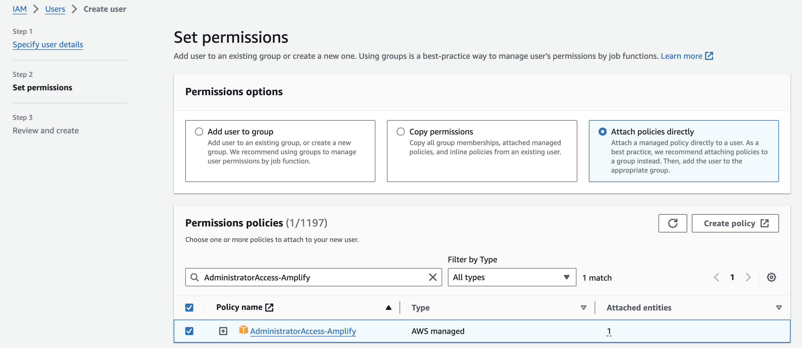
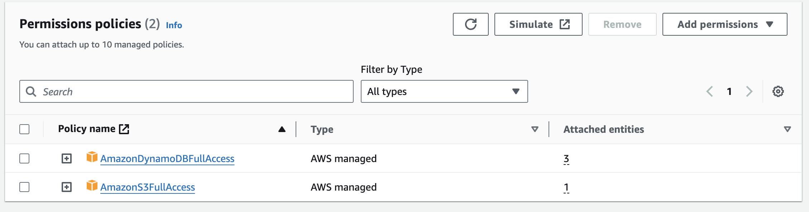
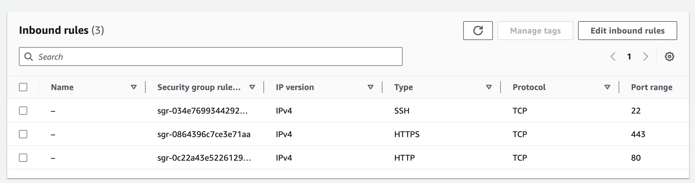
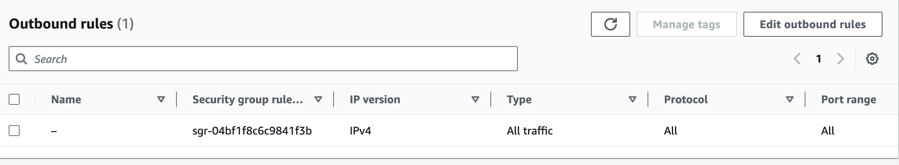
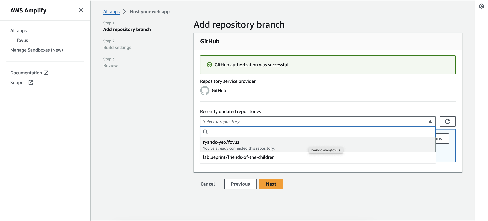
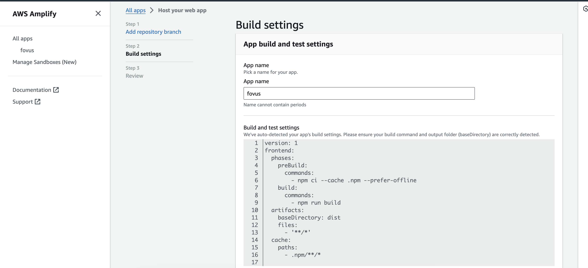

# Fovus Coding Challenge

This is Ryan Yeo's repository for the Fovus Coding Challenge. Instructions can be found on [this](https://docs.google.com/document/d/1UJUpYPP8u-9AFvzWergmr8gNweNV6v6YSMBZOJpX718/edit) document.

A demo of this project can be found [here](https://main.d1suua672mbhdr.amplifyapp.com/), hosted on Amplify.

## AWS Setup Instructions

Follow these steps to set up and run the project:

### 1. Clone the Repository

Make sure your node version is >=18.17.0.

In a new directory, run the following command in your terminal to clone this repository:

```bash
git clone https://github.com/ryandc-yeo/fovus.git .
npm install
```

### 2. Running a Local Instance

```bash
npm run dev
```

Open [http://localhost:5173](http://localhost:5173) with your browser to see the result.

### 3. Publish to Github

End your local instance, then in your terminal:

```bash
git init
git add .
git commit -m "init commit"
```

Now you need to visit your GitHub account and create a new Repository. Exclude creating 'README.md', '.gitIgnore' files. Also do not add any License to the repo. Sometimes these settings cause issue while pushing in.

Replace <github-repository-url> with the URL of your GitHub repository.

```bash
git remote add origin <github-repository-url>
git push -u origin main
```

### 4. Create IAM User

Create a new user and attach the policy `AdministratorAccess-Amplify`.


Save the arn (arn:aws:iam::123456789012:user/your-user) for the next section.

### 5. Setup Amazon S3 Bucket

To store our txt files, we want to create a S3 Bucket, make sure it has the following Bucket policy:

```
{
    "Version": "2012-10-17",
    "Statement": [
        {
            "Sid": "AllowAccessToSpecificUsers",
            "Effect": "Allow",
            "Principal": {
                "AWS": [
                    "arn:aws:iam::123456789012:user/your-user"
                ]
            },
            "Action": [
                "s3:List*",
                "s3:Get*",
                "s3:GetObject",
                "s3:PutObject"
            ],
            "Resource": [
                "arn:aws:s3:::ryfovusbucket/*"
            ]
        },
        {
            "Sid": "DenyPublicAccess",
            "Effect": "Deny",
            "Principal": "*",
            "Action": [
                "s3:List*",
                "s3:Get*",
                "s3:GetObject",
                "s3:PutObject"
            ],
            "Resource": [
                "arn:aws:s3:::ryfovusbucket/*"
            ]
        }
    ]
}
```

Make sure your bucket has the following Cross-origin resource sharing (CORS) configuration:

```
[
    {
        "AllowedHeaders": [
            "*"
        ],
        "AllowedMethods": [
            "PUT",
            "POST",
            "DELETE",
            "GET"
        ],
        "AllowedOrigins": [
            "*"
        ],
        "ExposeHeaders": []
    }
]
```

### 6. API Gateway Setup

We're going to need to setup REST APIs (not private) using API Gateway, then once created, create an OPTIONS and POST method. Make sure to allow Access-Control-Allow-Methods for both methods:

- Access-Control-Allow-Headers: Content-Type,X-Amz-Date,Authorization,X-Api-Key,X-Amz-Security-Token
- Access-Control-Allow-Origin: \*

Once the setup is complete, deploy your API onto a new stage and save the Invoke URL.

### 7. Create EC2 Instance

In order to create our own EC2 instances, we need to setup one manually first and use its AMI.

- Create a new instance and name it
- Use Amazon Linux for your Amazon Machine Image (AMI)
- I would use default settings for the Instance Type (t2.micro)
- Create a new key pair using defaults (RSA pair type, .pem private key format). Save the name of this key pair for lambda environment.
- For Network Settings, create a new security group with: allow SSH traffic from (your specific URL), and allow HTTP/HTTPS traffic from internet.

Create the EC2 instance and then stop it to save resources.

### 8. Script

Let's create our script that we want to retrieve and execute in our EC2 instance! First create a local file named `script.sh` then fill in the following:

```
#!/bin/bash

# define variables
BUCKET_NAME="<bucket_name>"
DYNAMODB_TABLE="<dynamodb_table_name>"
OUTPUT_FILE="output"
TMP_DIR="/tmp"
FILE_NAME=$(basename "$input_file_path")

# define functions
get_dynamodb_values() {
    aws dynamodb scan \
        --table-name "$DYNAMODB_TABLE" \
        --projection-expression "id" \
        --query "Items[*].id.S" \
        --output json | jq -r '.[]'
}

download_file() {
    local input_file_path="$1"
    sudo mkdir $TMP_DIR/
    sudo chmod 777 $TMP_DIR/
    aws s3 cp "s3://$input_file_path" "$TMP_DIR/"
}

append_text_to_file() {
    local input_text="$1"
    local input_file="$2"
    local output_file="$3"
    local file_content="$(cat "$TMP_DIR/$input_file")"
    echo "$file_content : $input_text" > "$TMP_DIR/$output_file.txt"
}

upload_file_to_s3() {
    local output_file="$1"
    local input_id="$2"
    aws s3 cp "$TMP_DIR/$output_file.txt" "s3://$BUCKET_NAME/$input_id+$output_file.txt"
}

update_dynamodb() {
    local output_file="$1"
    local input_id="$2"
    aws dynamodb update-item \
        --table-name "$DYNAMODB_TABLE" \
        --key '{"id": {"S": "'"$input_id"'"}}' \
        --update-expression "SET output_file_path = :output" \
        --expression-attribute-values '{":output":{"S":"'"$BUCKET_NAME/$input_id+$output_file.txt"'"}}' \
        --return-values NONE
}

# main script
all_ids=$(get_dynamodb_values)
for id in $all_ids; do
    dynamodb_values=$(aws dynamodb query \
                        --table-name "$DYNAMODB_TABLE" \
                        --key-condition-expression "id = :id" \
                        --expression-attribute-values '{":id":{"S":"'"$id"'"}}' \
                        --query "Items[*].{InputFilePath: input_file_path.S, InputText: input_text.S}" \
                        --output json)

    input_file_path=$(echo "$dynamodb_values" | jq -r '.[].InputFilePath')
    input_text=$(echo "$dynamodb_values" | jq -r '.[].InputText')

    download_file "$input_file_path"
    FILE_NAME=$(basename "$input_file_path")
    append_text_to_file "$input_text" "$FILE_NAME" "$OUTPUT_FILE"
    upload_file_to_s3 "$OUTPUT_FILE" "$id"
    update_dynamodb "$OUTPUT_FILE" "$id"
done

echo "Process completed successfully."
```

Remember to replace `<bucket_name>` and `<dynamodb_table_name>` with your own. Now, upload this file into your S3 Bucket with the same name `script.sh`.

### 9. IAM role

Create an IAM role and attach the following policies:

This is to give permission for our EC2 instance to make changes to our S3 Bucket and DynamoDB Table.

### 10. Security Group

Create a security group with inbound rules of:


And outbound rules of:


### 11. Lambda Trigger

We're going to need a lambda function to create our EC2 instance when DynamoDB get's updated, so create a function and configure the following environment variables:

```bash
AMI=<EC2_ami_id>
ARN=<name_of_iam_role>
INSTANCE_TYPE=<ec2_instance_type>
KEY_NAME=<ec2_key>
REGION=<region>
SECURITY_GROUP=<ec2_security_group_name>
```

Now for the function, use:

```
import { EC2Client, RunInstancesCommand } from '@aws-sdk/client-ec2';

export const handler = async (event) => {
    const REGION = process.env.REGION;
    const AMI = process.env.AMI;
    const INSTANCE_TYPE = process.env.INSTANCE_TYPE;
    const KEY_NAME = process.env.KEY_NAME;
    const ARN = process.env.ARN;
    const SECURITY_GROUP = process.env.SECURITY_GROUP;

    const ec2Client = new EC2Client({ region: REGION });

    const runInstancesParams = {
        ImageId: AMI,
        InstanceType: INSTANCE_TYPE,
        KeyName: KEY_NAME,
        SecurityGroupIds: [
            SECURITY_GROUP
        ],
        MaxCount: 1,
        MinCount: 1,
        InstanceInitiatedShutdownBehavior: 'terminate',
        IamInstanceProfile: {
            Name: ARN,
        },
        UserData: Buffer.from("#cloud-boothook\n#!/bin/bash\naws s3 cp s3://<bucket_name>/<script_name>.sh ./tmp/script.sh\nchmod +x ./tmp/script.sh\n./tmp/script.sh\nsudo shutdown now -h").toString('base64')
    };

    const runInstancesCommand = new RunInstancesCommand(runInstancesParams);
    try {
        const data = await ec2Client.send(runInstancesCommand);
        console.log("Instance ID:", data.Instances[0].InstanceId);
        event.processed = true;
    } catch (err) {
        console.error("Error:", err);
    }
}
```

Remember to replace `<bucket_name>` and `<script_name>` in your UserData script. This will be the script that automatically executes upon creating the new EC2 instance.

### 12. DynamoDB FileTable

Now, we can finally create our DynamoDB Table. Give a name, make sure that it's the same name used in `script.sh`. Then define the partition key to be 'id' as string type.

Then using DynamoDB Streams, link the Lambda trigger that we created in Step 11 to invoke the AWS Lambda function every time an item is changed.

### 13. Setup AWS Amplify

We're going to host this repository on AWS Amplify for general CI/CD purposes. Make sure to setup a free AWS account first.

Then on AWS Console, start a New App by choosing "Host web app", then choose Github for the source code. After going through authorization setps, select your repository:



Name your app, and make sure your build settings look like this: 
Make sure the build command is `npm run build` and the baseDirectory is `dist`. Under "Advanced settings", make sure to add your environmental variables. You should have the following:

```
VITE_AWS_ACCESS_KEY_ID=<access_key_for_s3>
VITE_AWS_SECRET_ACCESS_KEY=<secret_access_key_for_s3>
VITE_AWS_API=<invoke_url_from_api_gateway>
VITE_AWS_BUCKET_NAME=<s3_bucket_name>
VITE_AWS_REGION=<region_name>
```

You can now save and deploy your Amplify hosted app!

## Takeaways

I had a lot of fun over the past few days getting familiar with the different AWS services and automating it all. The largest blocker was having to implement the AWS SDK using JavaScript V3 because whenever I ran into issues, the forums were mostly solutions for V2, therefore I heavily relied on the official documentation throughout this process.

I managed to meet all the basic requirements, and a few of the bonus points, such as: using Amplify hosting for CI/CD and using ReactJS/Flowbite TailwindCSS for response UI.

If given more time and experience, I would have definitely used AWS Cognito as API-Gateway Authorizer for more security and I would have refined the way I implemented the Lambda trigger, because currently it creates an extra instance after we use the EC2 script to update our DynamoDB FileTable with `output_file_path`. This imposes extra processing but doesn't actually change the final result though, so it qualifies for the basic requirement.

## References

Official Documentations:

- [AWS SDK for JavaScript v3](https://docs.aws.amazon.com/AWSJavaScriptSDK/v3/latest/)
- [Flowbite TailwindCSS](https://flowbite.com/docs/getting-started/introduction/)
- [Flowbite React](https://flowbite-react.com/)

Used the following resources for debugging and general guidance:

- https://developer.mozilla.org/en-US/docs/Web/API/File_API/Using_files_from_web_applications
- https://github.com/vitejs/vite/discussions/5912
- https://www.youtube.com/watch?v=O-p8yCEokcc
- https://github.com/aws/aws-sdk-js-v3/tree/main/lib/lib-dynamodb
- https://docs.aws.amazon.com/apigateway/latest/developerguide/apigateway-enable-cognito-user-pool.html
- https://stackoverflow.com/questions/46276837/aws-lambda-not-connecting-with-dynamo-db
- https://github.com/aws/aws-sdk-js/issues/1769
